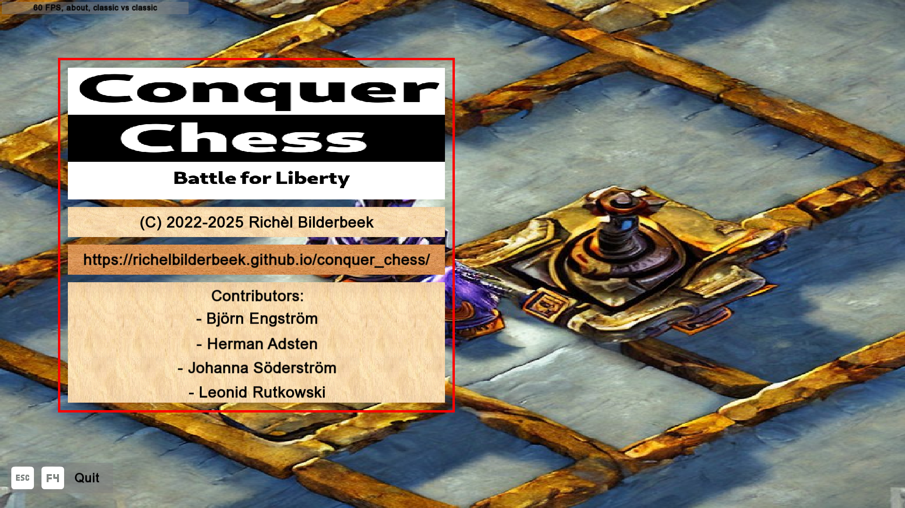

---
tags:
  - acknowledgements
  - contributors
  - credits
---

# Acknowledgments

## Contributors

- Artwork:
  - Johanna Söderström
- Beta testing: 
  - Björn Engström
  - Herman Adsten
  - Leonid Rutkowski

## Fellow programmers

Name                                                     |Library
---------------------------------------------------------|---------------------------------------------------------------
[Daniil `Neargye` Goncharov](https://github.com/Neargye) |[magic_enum](https://github.com/Neargye/magic_enum)
[Jerrit `jerr-it` Gläsker](https://github.com/jerr-it)   |[SFGraphing](https://github.com/jerr-it/SFGraphing)
[Max `Disservin` Disservin](https://github.com/Disservin)|[chess-library](https://github.com/Disservin/chess-library.git)

## Starcraft casters

There are plenty of fun Starcraft casters,
these are my favorite, in alphabetical order:

- `feardragon`
- `Harstem`
- `Lowko`
- `PiG`
- `ZombieGrub`
