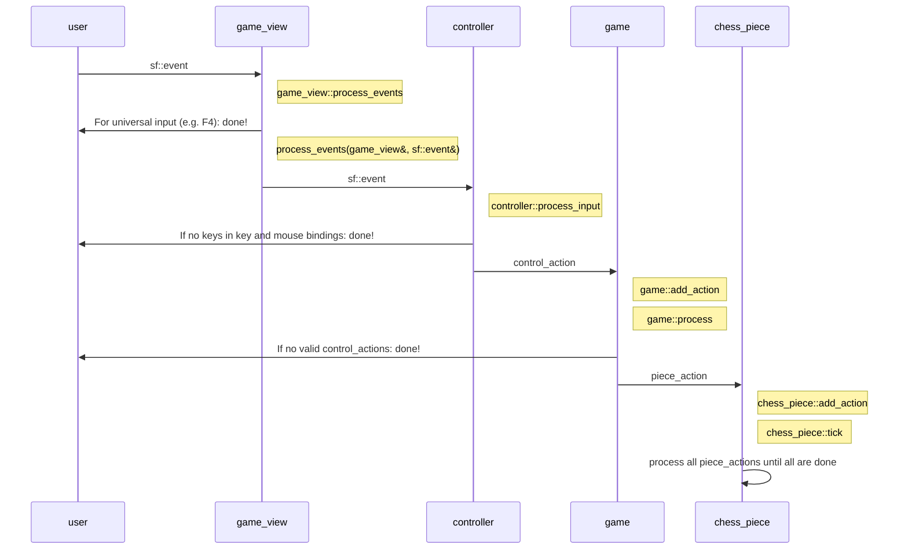

# Architecture

## Handling time

- `game` holds the main in-game time.
- At the start:
    - The game time is zero
    - Each `piece` its (assumed) in-game time is zero
- Upon `game::tick`:
    - It is checked that `game` and each `piece` assume the same in-game time
    - The game time is updated
    - Each `piece` updates its idea of in-game time.
    - It is checked again that `game` and each `piece`
      assume the same in-game time. Pieces that are lagging did not update.

## Handling user input

The key and mouse talk to `user_inputs`,
or: `user_inputs` handles all the `sf::Event`s.
However, not all events are valid.
For example, an LMB can be ignored if all players
use the keyboard. `user_inputs` only keeps the keys that are setup in the
'Key Settings'/'Controls' dialog.

<!-- markdownlint-disable MD013 --><!-- Tables cannot be split up over lines, hence will break 80 characters per line -->

| Input                    | Class                                         | Output                                  |
| ------------------------ | --------------------------------------------- | --------------------------------------- |
| keyboard and mouse input | `user_inputs`  | Store valid input, ignore invalid input |

<!-- markdownlint-enable MD013 -->

`game_controller` gets all `user_inputs` and moves the right cursor
(there is one cursor for each player) to the right spots.
It can select a piece to do a chess move.

<!-- markdownlint-disable MD013 --><!-- Tables cannot be split up over lines, hence will break 80 characters per line -->

| Input       | Class                                                     | Output                             |
| ----------- | --------------------------------------------------------- | ---------------------------------- |
| Valid input | `game_controller`  | Moves the cursor, does chess moves |

<!-- markdownlint-enable MD013 -->

The chess moves that `game_controller` suggests
may not be valid and do not move pieces.
`game` checks if the chess move is valid and if yes,
does the move.

<!-- markdownlint-disable MD013 --><!-- Tables cannot be split up over lines, hence will break 80 characters per line -->

| Input       | Class                    | Output                                                      |
| ----------- | ------------------------ | ----------------------------------------------------------- |
| Chess moves | `game`  | Performs the valid chess moves, ignores invalid chess moves |

<!-- markdownlint-enable MD013 -->
