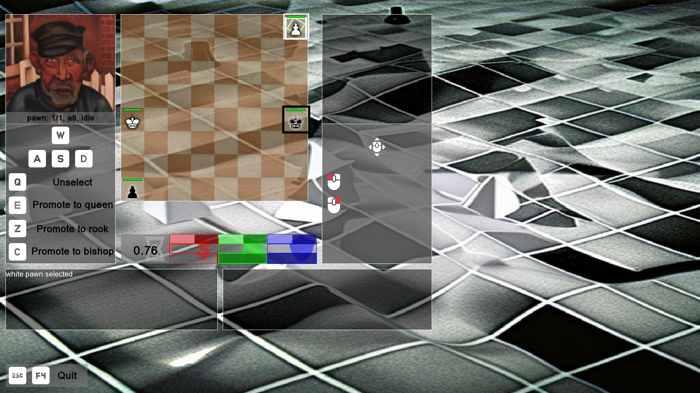
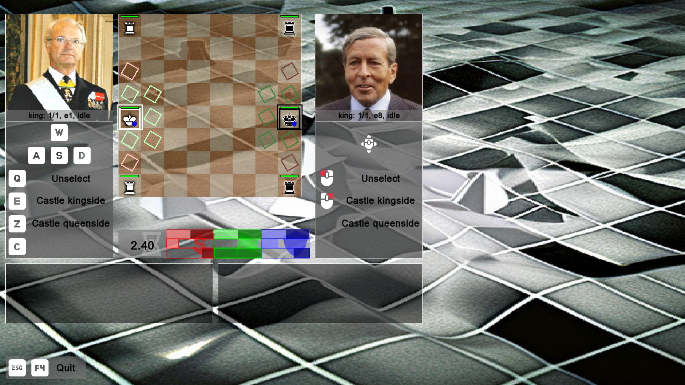

---
tags:
  - FAQ
  - frequently asked questions
  - questions
  - answers
---

# Frequently Asked Questions

## General

### What is Conquer Chess?

Conquer Chess is a real-time strategy game
that is a mix between chess and some classic real-time strategy games.

There is a chess variant called
[Conquer](https://www.chessvariants.com/invention/conquertheopponentsarmy),
which has nothing to do with this game.

### Why the name 'Conquer Chess: Battle for Liberty'?

The name 'Conquer Chess: Battle for Liberty' is a mix
of classic real-time strategy games:

- Command and **Conquer**
- Dune 2: **Battle** for Arrakis
- Starcraft 2: Wings **of Liberty**

Mix those names and you'll get 'Conquer Chess: Battle for Liberty'.

### How did you get the idea for Conquer Chess?

As a Dutch Starcraft II fan, I regularily watch videos
from Simon 'Lowko' Heijnen (e.g. at [Lowko](https://lowko.tv/)).
He sometimes calls Starcraft II 'high-speed chess'.
Because I incompletely agree with him,
I pondered on what high-speed chess would look like.
Conquer Chess is the result of those thoughts.

## What are the three races in Conquer Chess?

These are the three races in Conquer Chess:

Race name     |Description
--------------|-------------------------
Kingdom       |A human-like species
Rooxx         |An advanced alien species
Spawn         |A primitive alien species

## Why did you not pick the classic Starcraft races?

To avoid problems in areas I am unfamiliar with,
i.e. copyright and intellectual property.

## Why did you not pick the races from the Starcraf 2 Scion mod?

Because the people from the Starcraft 2 Scion mod
[preferred me not to](https://github.com/richelbilderbeek/conquer_chess/issues/113).

## Game rules

### What are the rules of Conquer Chess compared to chess?

Conquer Chess follows the rules of chess
in such a way that regular games can be played with it.

All rules can be found [in the rulebook](rulebook/README.md).

### Where did you get you example games from?

From [https://database.lichess.org/](https://database.lichess.org/).
There I took the earliest games played in january 2013
from (the now expired link)
`https://database.lichess.org/standard/lichess_db_standard_rated_2013-01.pgn.bz2`.

## Game settings

### What is the game speed?

In a game of Conquer Chess, time unit is measured in chess moves
([rulebook](rulebook/README.md) article `[1.1.CC.0]`).
For example, one can say that 'it takes 8 seconds per chess move'.

## Controls

Each player can control the game with a keyboard or a mouse,
with a maximum of 1 mouse user.

### Keyboard controls

The keyboard has 4 action keys.

The game shows what each key does in a certain context.

???- question "Are 4 action keys enough?"

    Almost always yes.

    

    > A keyboard player cannot promote to a knight if a piece is selected.

    It is possible to have 5 possible actions,
    for example, when the cursor is on a selected pawn
    that is ready to promote.
    The actions will be:

    - Unselect
    - Promote to queen
    - Promote to rook
    - Promote to bishop
    - Promote to rook

    The fifth action, hence, cannot be chosen.

### Mouse controls

The mouse has 2 action buttons.

The game shows what each button does in a certain context.

???- question "Are 2 action keys enough?"

    Almost always yes.

    

    > A mouse player cannot castle queenside if a piece is selected.

    It is possible to have 3 possible actions,
    for example, when the cursor is on a selected king
    that can castle both king- and queenside.
    The actions will be:

    - Unselect
    - Castle kingside
    - Castle queenside

    The third action, hence, cannot be chosen.
    This can be solved by moving the cursor to an empty square.

    Additionally, it is possible to have 5 possible actions,
    for example, when the cursor is on a selected pawn
    that is ready to promote. The actions will be:

    - Unselect
    - Promote to queen
    - Promote to rook
    - Promote to bishop
    - Promote to rook

    The fifth action, hence, cannot be chosen.

## Technical

### How did you generate the FEN strings

I often used <https://www.365chess.com/analysis_board.php>.

### How is the user input handled?

See [architecture](architecture/README.md)

