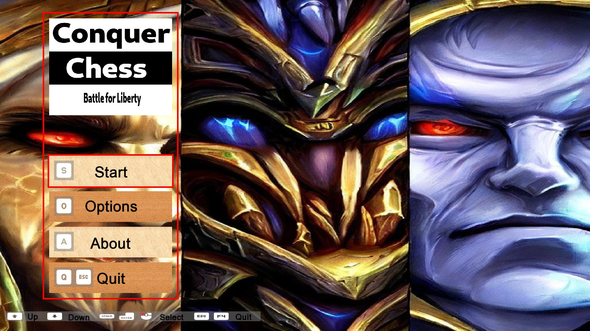
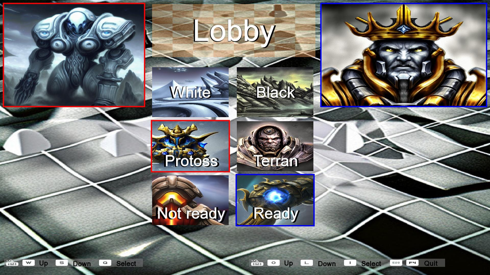
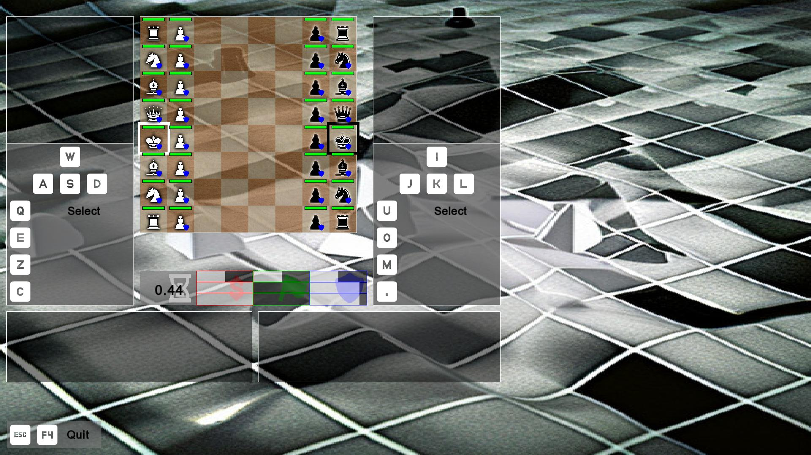

# Gameplay

This page describes how to play Conquer Chess.

## Main menu

The main menu is where you start. Here you can go to the game lobby,
change the settings of the game or view information about the game.

We need to go through the lobby to start the game.

To go to the lobby:

- Press 'S'
- Navigate to the Start button with the arrow keys and press Enter
- Click on the Start button

## Lobby

The lobby is where the match is set up.
Here the two players pick who plays which side
and which races they use.

The effect of each side is simple: white, like in regular chess, can start,
where black has to wait one chess move.

Side |Waiting time before first move
-----|-------------------------------
White|None
Black|One chess move

The effect of race

<!-- markdownlint-disable MD013 --><!-- Tables cannot be split up over lines, hence will break 80 characters per line -->

Race   |Movement speed [1] |Attack speed [2]  |Effect of allies [3] |Other features
-------|-------------------|------------------|---------------------|---------------
Classic|1                  |1                 |None                 |None
Protoss|0.9                |1.1               |Moves faster         |Regenerating shields
Terran |1.0                |1.0               |Heals                |Better armor
Zerg   |1.1                |0.9               |Attacks faster       |Regenerate

<!-- markdownlint-enable MD013 -->

- :construction: This is under contruction
- [1] In chess move per time unit
- [2] In chess move per time unit
- [3] That is, another friendly piece is protecting it

When both players are ready, there is a countdown and the game starts.

## Game

The goal of the game is to:

- put the king of the opponent into a checkmate (as per regular chess)
- kill the king of the opponent, by attacking it until its health reaches zero

The game is timed in chess moves.
This time is shown directly below the board.

The pieces move exactly the same as in regular chess.

Moving a piece takes one chess move (as per regular chess):
it takes just as long to move a pawn one square forward,
as to move a queen accross the board.

Capturing a piece takes one chess move (as per regular chess):
when a piece starts attacking, it will take one time unit
to lower the health of the attacked piece to zero.
When the health of the attacked piece reaches zero,
the attacker instantaneously moves to the square of the
captured piece.

