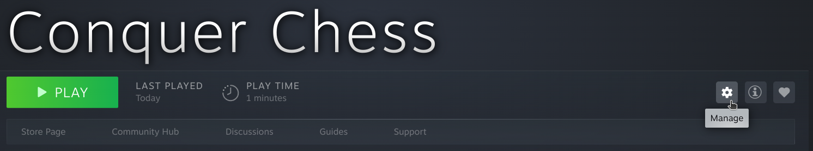
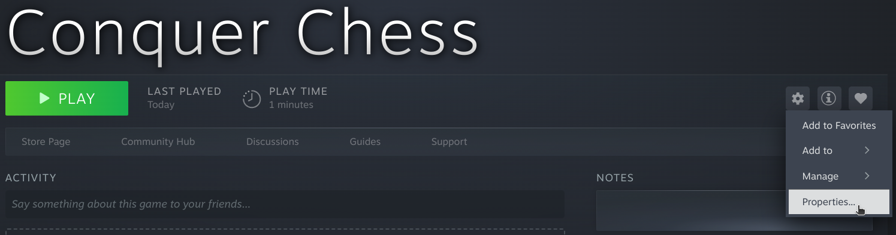
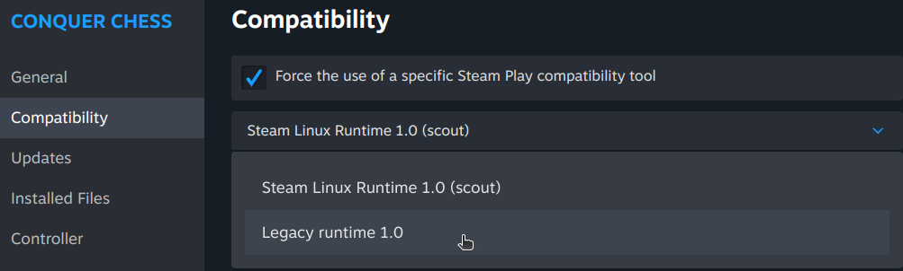

# Launch on Steam

Conquer Chess does not launch out of the box yet.
Here are the steps to launch Conquer Chess on Steam.

## 1. Click on 'Manage'

Go to 'Conquer Chess' in your Steam Library and click on 'Manage'.

## 2. Click on 'Properties'

In the 'Manage' pop-up menu, click on 'Properties'

## 3. Activate 'Legacy runtime 1.0'

In the 'Properties dialog', go the 'Compatibility' tab
and force the use of 'Legacy runtime 1.0':

## 4. Play Conquer Chess

Click on 'Play' to start Conquer Chess.
