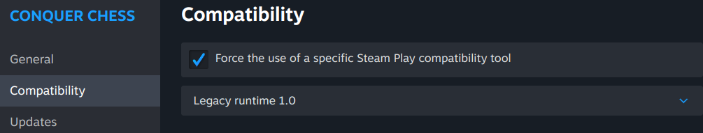

---
tags:
  - bug
  - error
  - report
  - submit
  - game does not start
---

# Reporting a pre-game bug
  
Conquer Chess has bugs that happen before the game even starts.

This page describes:

- `1.` Check you've used the correct launcher
- `2.` See the error

## `1.` Check you launch with 'Legacy runtime 1.0'

These should be your Conquer Chess properties:



To do so, read [how to select the right Steam launcher](launch_on_steam/README.md#1-click-on-manage).

## `2.` See the error

To see the error, run the game from a terminal.

Go to the Conquer Chess folder. There are two options,
depending on how you installed Steam

<!-- markdownlint-disable MD013 --><!-- Tables cannot be split up over lines, hence will break 80 characters per line -->

How Steam was installed|How to go to the Conquer Chess folder
-----------------------|--------------------------------------------------------------------------
Via `apt`              |`cd ~/.local/share/Steam/steamapps/common/conquer_chess`
Via `snap`             |`cd ~/snap/steam/common/.local/share/Steam/steamapps/common/conquer_chess`

<!-- markdownlint-enable MD013 -->

In that folder, run Conquer Chess:

```bash
./conquer_chess
```

This will produce an message.

If you see an error similar to the one below,
read [how to install the needed libraries](launch_on_steam/README.md#0-install-the-dependencies).

<!-- markdownlint-disable MD013 --><!-- Verbatim output cannot be split up over lines, hence will break 80 characters per line -->

```text
./conquer_chess: error while loading shared libraries: libsfml-graphics.so.2.6: cannot open shared object file: No such file or directory
```

<!-- markdownlint-enable MD013 -->

If that fails, or you see another error message,
please [create an issue](https://github.com/richelbilderbeek/conquer_chess/issues)
which includes the error message.

Users that submit a proper bug report will be
[acknowledged](acknowledgements.md).
