# Screenshots

## v0.8

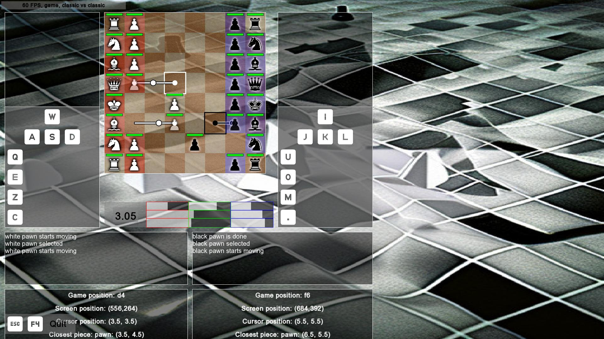

> The game screen shows the piece values (red), activity (green) and
> protectedness (blue) of the players.
> The upper bar shows the ration between the player,
> the middle bar the value of the left player,
> the lower bar the value of the right player.

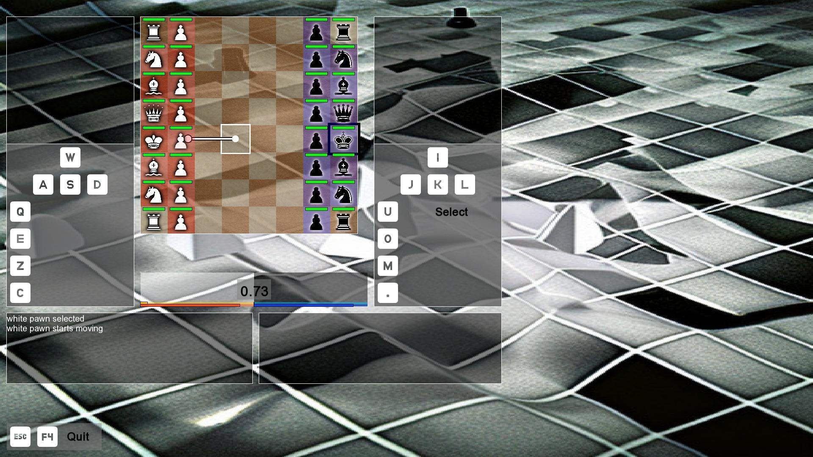

> The game screen shows the relative strengths of the players,
> the percentage of pieces being active
> and the percentage of pieces being protected.

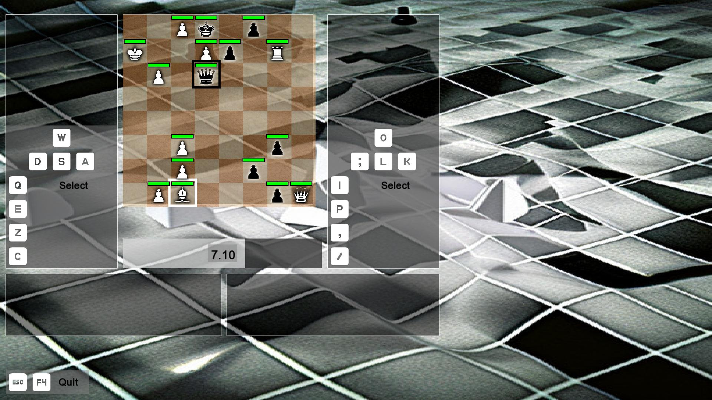

> The game screen shows the relative strengths of the players

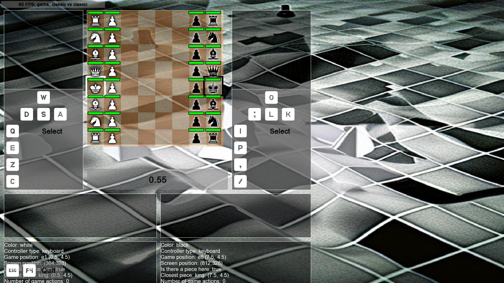

> The game screen shows the time

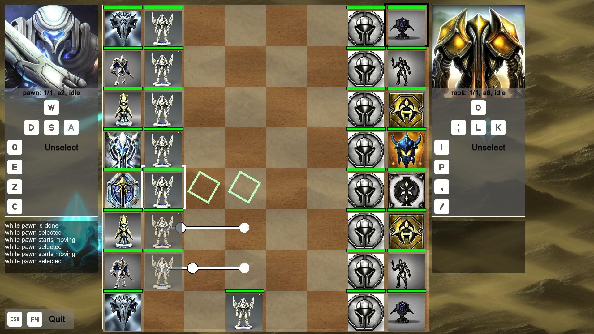

> The game screen, now for protoss (left) versus terran (right)

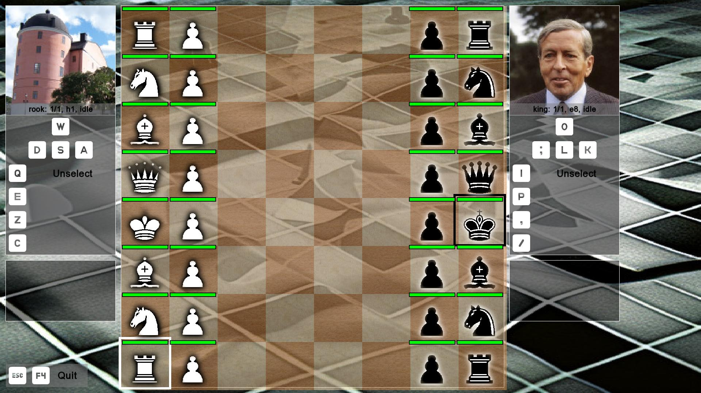

> The game screen for the classic pieces

> The menu screen

> The lobby screen

## v0.7

???- question "Version v0.7"

    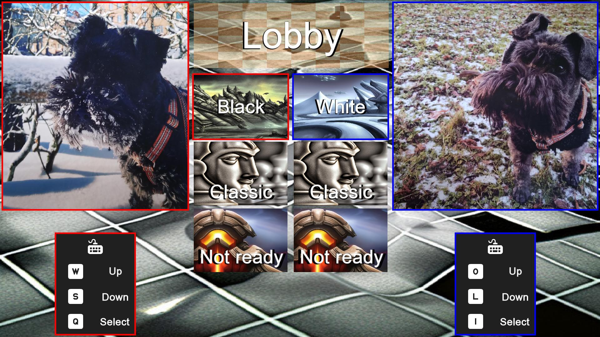

    > The Lobby screen in dog mode

    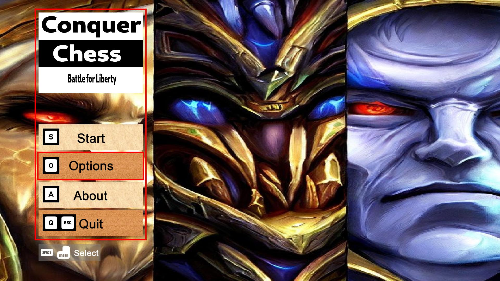

    > The Main menu screen shows the controls

    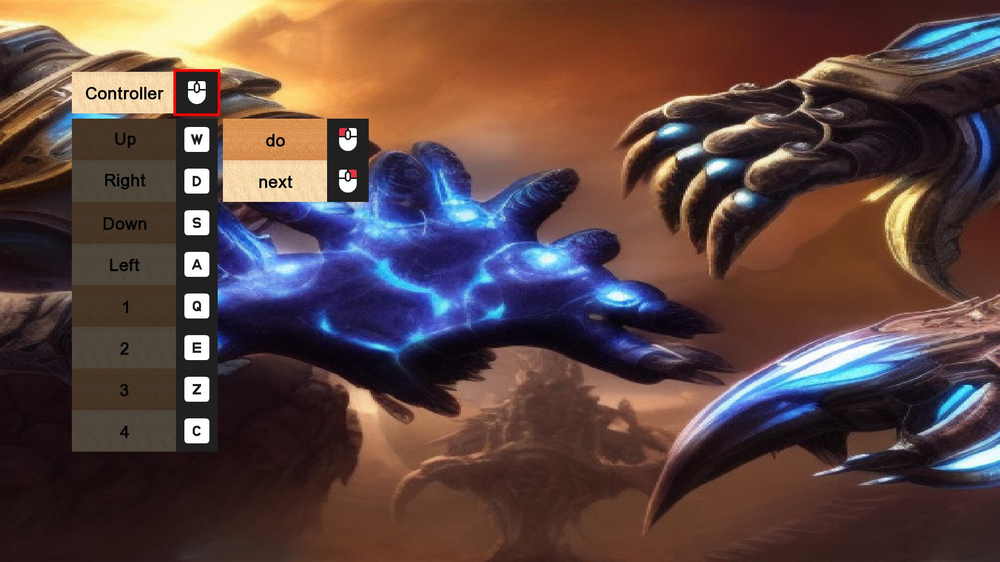

    > The Controls screen shows the mouse buttons too

    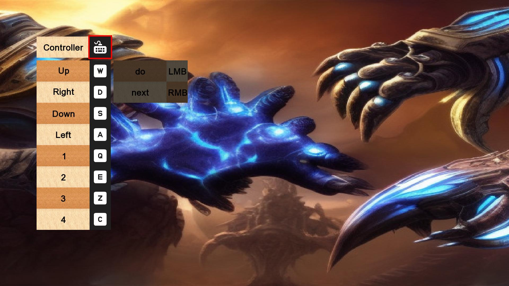

    > The Controls screen looks prettier

    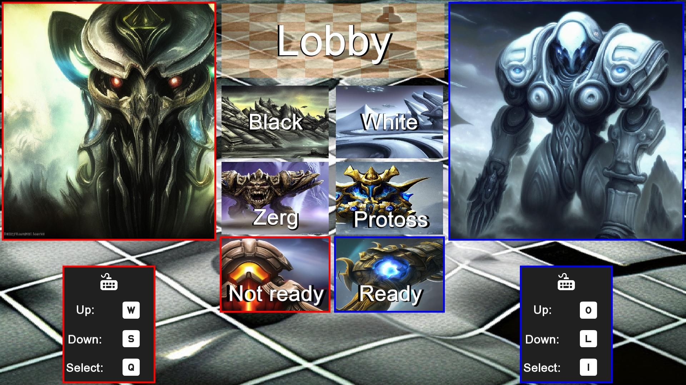

    > The Lobby screen uses symbols to indicate the controls

    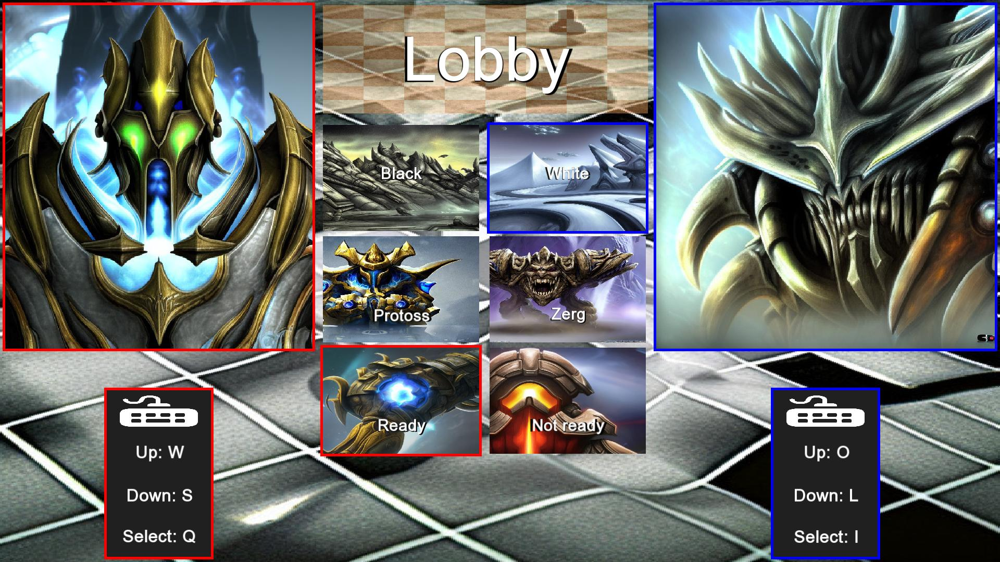

    > The Lobby screen looks prettier

    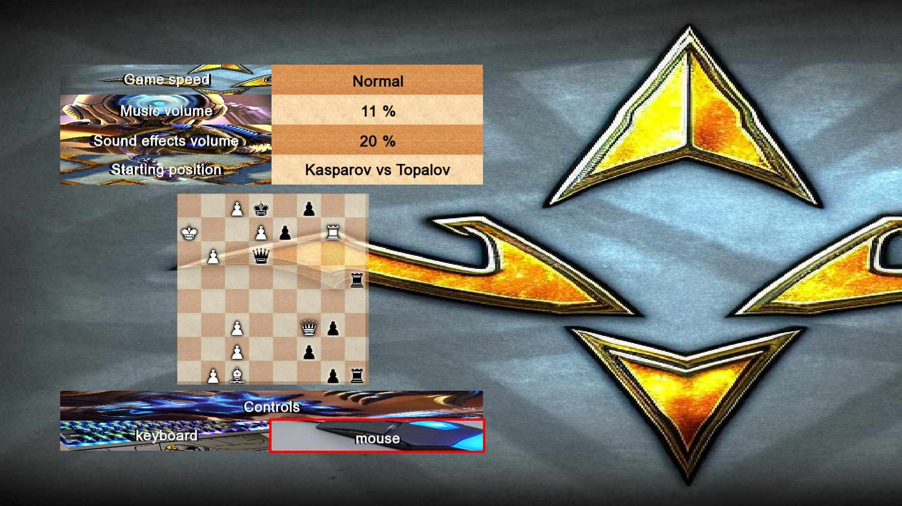

    > The Options screen looks prettier

    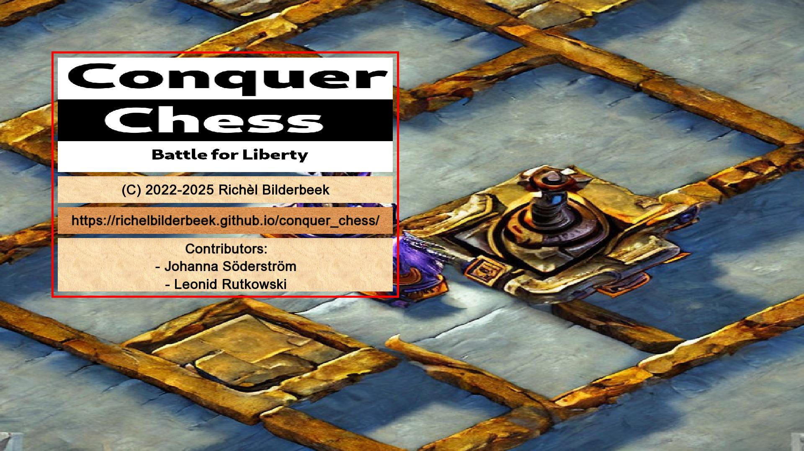

    > The About screen looks prettier

    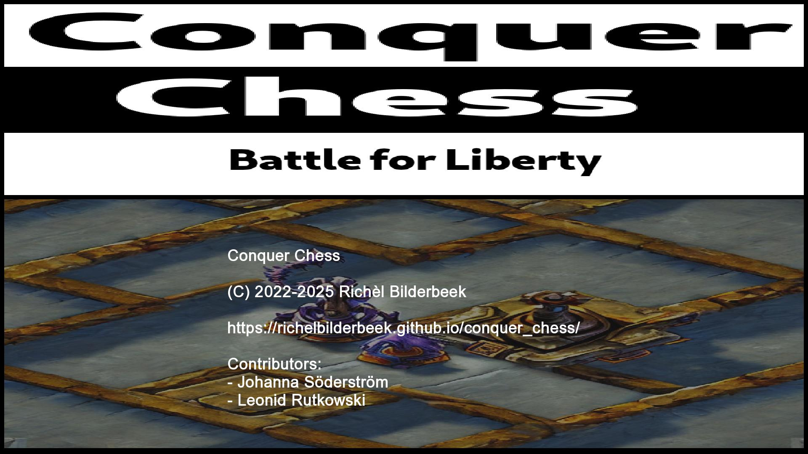

    > The About screen shows names that are spelled correctly

    

    > The game title

    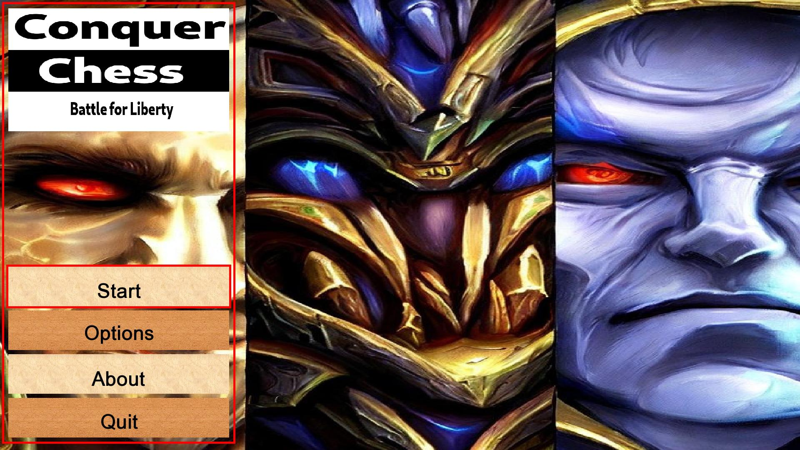

    > There are multiple background images in the main menu

    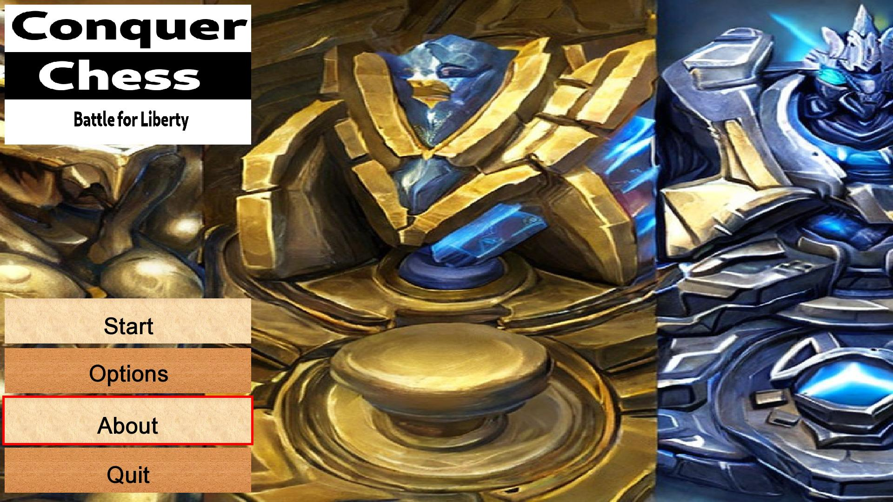

    > The main menu's background image fills the entire screen

    

    > The main menu screen is now full screen

    

    > Added symbols for the actions

    

    > Added symbols for the actions

    

    > Portraits are bigger

    

    > Show where pieces can go

## v0.6

???- question "Version v0.6"

    

    

## v0.5

???- question "Version v0.5"

    

    

    > The About screen does not show names yet that are spelled correctly

    

    

    

    

    

## v0.4

???- question "Version v0.4"

    

    

    

    

    

    

    

    

    

    

    

    

    

    

    

    

    

    

    

    

    

## v0.3

???- question "Version v0.3"

    

    

    

    

    

    

    

    

    

## v0.2

???- question "Version v0.2"

    

    

    

    

    

    

    

    

    

    

    

    

    

## v0.1

???- question "Version v0.1"

    

    

    

    

    

    

    

    

    

    

    

    

    
