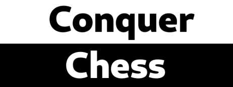
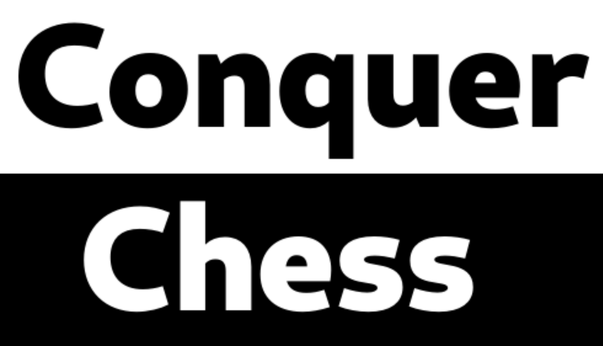
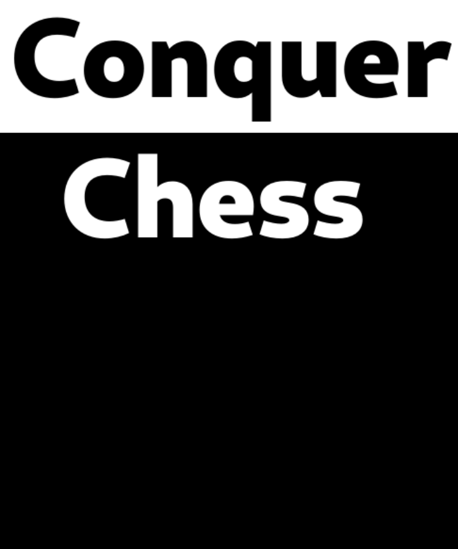
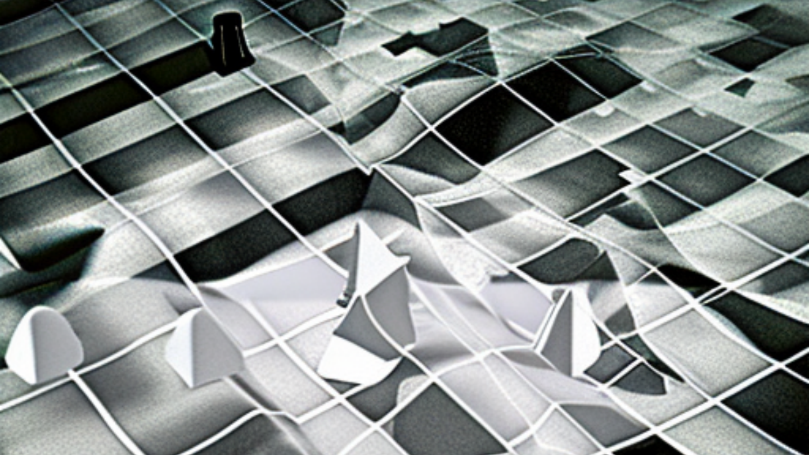

# Steamworks resources

## Header Capsule 

- Design: This image should focus on the branding of your product. For best results, please use the same artwork that you use for any retail box or marketing and make sure the logo is clearly legible.
- Usage: It will appear at the top of your page in the store, in the 'recommended for you' section, in 'grid view' in customers libraries in the Steam client, in browse views on Big Picture mode, and for daily deals if applicable.
- Sizes: 920px x 430px

[Header Capsule](header_capsule_920_x_430.png)

## Small Capsule 

- Design: These are small, so they should focus on making the logo clearly legible, even at the smallest size.
- Usage: These are used for all the lists throughout Steam. Search results, top-sellers, new releases, etc.
- Sizes: 462px x 174px
- Requirements: Small Capsule should contain readable logo, even at smallest size. In most cases, this means your logo should nearly fill the small capsule.

## Main capsule

- Design: These should be designed to market the product. For best results, please use the key art and logo that is being used for any retail boxes or marketing. Do not include quotes, review scores, or awards.
- Usage: These appear at the top of the front page in the featured and recommended carousel.
- Sizes: 1232px x 706px

## Vertical capsule

- Vertical Capsule *748px wide x 896px tall
- Design: This is a vertical asset that is designed to market your game. For best results, please use the key art and logo that is being used for any retail boxes or marketing. Do not include quotes, review scores, or awards.
- Usage: These can appear at the top of the front page during seasonal sales, and on other new sale pages.
- Sizes: 748px x 896px

## Background

- Design: This should be ambient so as not to compete with the content on the page, so try to avoid high-contrast images or images with lots of text. A template will automatically be applied to your uploaded file, which will tint it blue and fade out the edges. If you don't upload an image here, we'll automatically take a random screenshot and generate a background image from that.
- Usage: This is the image that will be used in the background of your store page.
- Size:	1438px x 810px

## Game manuals, quick reference guides, and read-me files

- Usage: These manuals are accessible from the Steam client.
- Format: Please upload as .pdf files.
- Online Manuals? Link to online manuals on the Basic Info tab.
