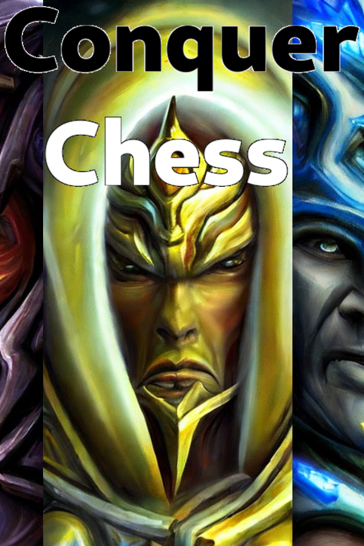

# Steamworks resources

## Header Capsule

- Design: This image should focus on the branding of your product.
  For best results, please use the same artwork that you use
  for any retail box or marketing and make sure the logo is clearly legible.
- Usage: It will appear at the top of your page in the store,
  in the 'recommended for you' section, in 'grid view' in customers libraries
  in the Steam client, in browse views on Big Picture mode,
  and for daily deals if applicable.
- Sizes: 920px x 430px

[Header Capsule](header_capsule_920_x_430.png)

## Small Capsule

- Design: These are small, so they should focus on making the logo clearly
  legible, even at the smallest size.
- Usage: These are used for all the lists throughout Steam.
  Search results, top-sellers, new releases, etc.
- Requirements: Small Capsule should contain readable logo,
  even at smallest size. In most cases, this means your logo
  should nearly fill the small capsule.
- Sizes: 462px x 174px

## Main capsule

- Design: These should be designed to market the product.
  For best results, please use the key art and logo that is being used
  for any retail boxes or marketing.
  Do not include quotes, review scores, or awards.
- Usage: These appear at the top of the front page in the featured
  and recommended carousel.
- Sizes: 1232px x 706px

## Vertical capsule

- Design: This is a vertical asset that is designed to market your game.
  For best results, please use the key art and logo that is being used
  for any retail boxes or marketing.
  Do not include quotes, review scores, or awards.
- Usage: These can appear at the top of the front page during seasonal sales,
  and on other new sale pages.
- Sizes: 748px x 896px

## Background

- Design: This should be ambient so as not to compete with the content
  on the page, so try to avoid high-contrast images or images
  with lots of text. A template will automatically be applied to your uploaded
  file, which will tint it blue and fade out the edges.
  If you don't upload an image here, we'll automatically take a random
  screenshot and generate a background image from that.
- Usage: This is the image that will be used
  in the background of your store page.
- Size: 1438px x 810px

## Game manuals, quick reference guides, and read-me files

- Usage: These manuals are accessible from the Steam client.
- Format: Please upload as .pdf files.
- Online Manuals? Link to online manuals on the Basic Info tab.

## Library Capsule

- Design: This should be graphically-centric and give the user some
  sense of the experience. Please use the key art that is being used
  for any retail boxes or marketing as well as the name of your game,
  ideally using the same logo / title as printed on any retail or marketing.
  Do not include quotes, marketing copy, or other strings of text beyond the
  title of your application. The art should depict something important
  about your product. The logo should be easily legible against the background.
- Usage: This image is primarily used in the library
  overview and collection views
- Size: 600px x 900px (an additional half-size 300px x 450px PNG will
  be auto-generated from larger file)

## Library Header

- Design: This image should focus on the branding of your product.
  For best results, please use similar artwork to the Library Capsule
  and make sure the logo is clearly legible.
- Usage: Appears in various places in the Steam Client Library,
  including Recent Games. If not set, then the Header Capsule is used.
- Size: 920px wide x 430px tall

## Library Hero

- The hero graphic and logo are layered and move independently
  when the page is scrolled, creating a subtle parallax effect.
  Consider how the product logo will be placed on top of the hero image
  (left bottom corner or centered). You'll want to ensure the logo is both
  visible and legible against the background.
- Design: This should be a visually rich image that is easily recognizable.
  For best results, please use the key art that is used for any retail boxes
  or marketing. Do not include quotes or other strings of text.

  At the center of the template is a "safe area" of 860px x 380px.
  This area will remain uncropped across scaling and resizing
  of the Steam client window. Artwork should extend across the entire template,
  but critical content should be within the safe area.
  For ex: a main character's face should be entirely in the safe area
  or risk being cropped.

  Library Hero image should not contain any text or logos.
  Your logo to display at the top of your library detail page should be
  uploaded separately in the Library Logo file (details below).
- Usage:
  Appears at the top of a user's library details page for this product.
- Size: 3840px x 1240px (an additional half-size 1920px x 620px PNG
  will be auto-generated from larger file)

## Library Logo

After upload, you can use the preview tool to select the logo's position.
Options include: left bottom corner, centered top, centered middle,
and centered bottom.

Note: If a hero graphic and logo are not uploaded,
the hero area will display a screenshot from the store,
with the application name in text overlaid in the bottom left corner.

- Design: For best results, use the logo that is being used for any
  retail boxes or marketing. You’ll want to ensure the logo is both visible
  and legible against the hero graphic background, sometimes a drop shadow
  can help. The PNG image should have a transparent background.
  You should use the best aspect ratio for your art, however the logo must
  be either 1280px wide and/or 720px tall.
- Usage: Appears at the top of a user's library details page for this product,
  placed on top of the hero graphic.
- Size: Either 1280px wide and/or 720px tall (an additional half-size PNG
  will be auto-generated based on your logo's aspect ratio).

