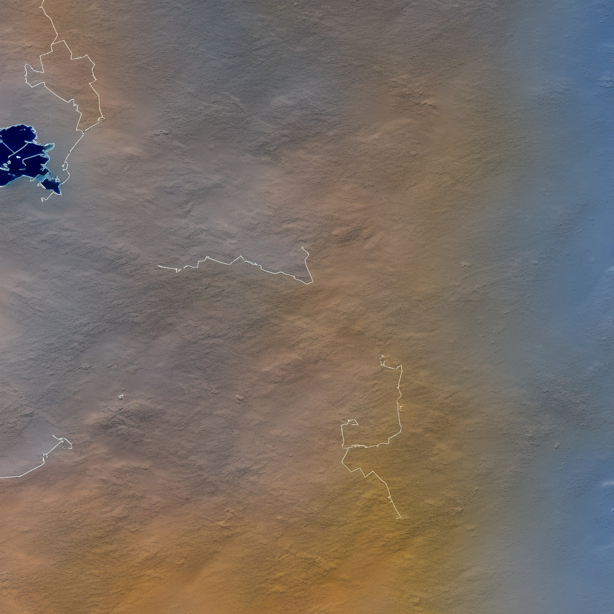

# Maps

<!-- markdownlint-disable MD013 --><!-- Tables cannot be split up over lines, hence will break 80 characters per line -->

| Image                   | Filename          | Search terms                                                                               |
| ----------------------- | ----------------- | ------------------------------------------------------------------------------------------ |
|  | `classic_map.jpg` | .                                                                                          |
|  | `keiron_map.jpg` | `keiron, map, simple, landscape, terrain, desolate, empty, futuristic, sacred, flat, big` |
|   | `genetron_map.jpg`  | `genetron, map, simple, landscape, terrain, barren, steel, big, empty, satellite image`      |
|     | `xayid_map.jpg`    | `xayid, map, simple, landscape, terrain, desolate, empty, creepy, toxic`                    |

<!-- markdownlint-enable MD013 -->
