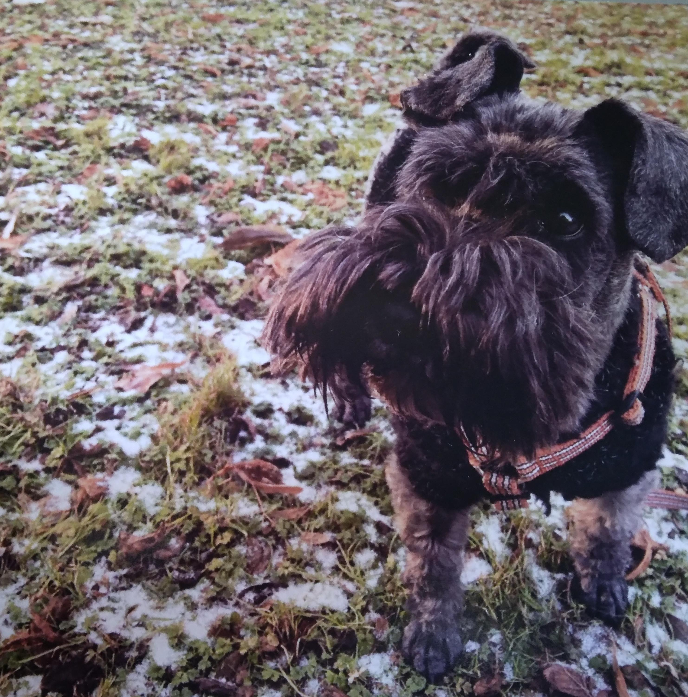
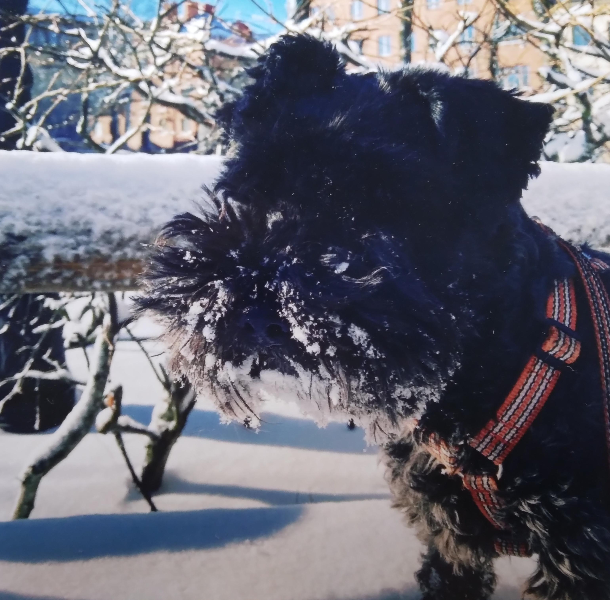
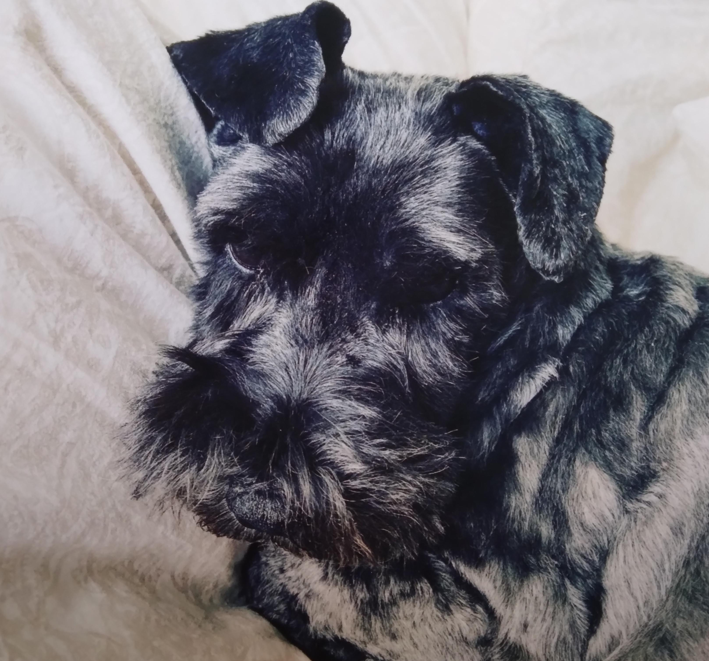
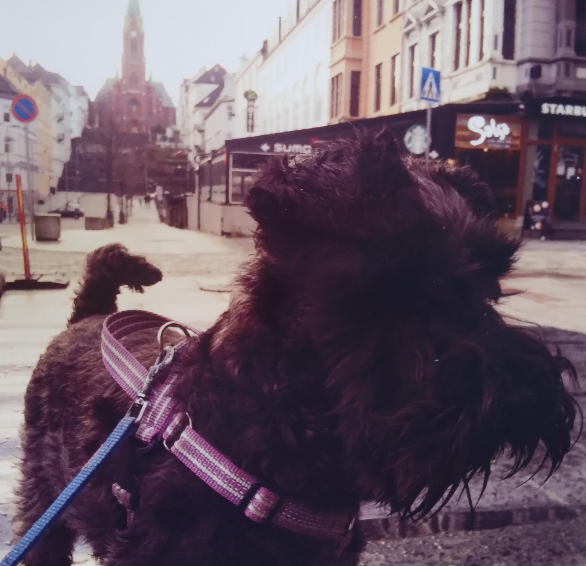
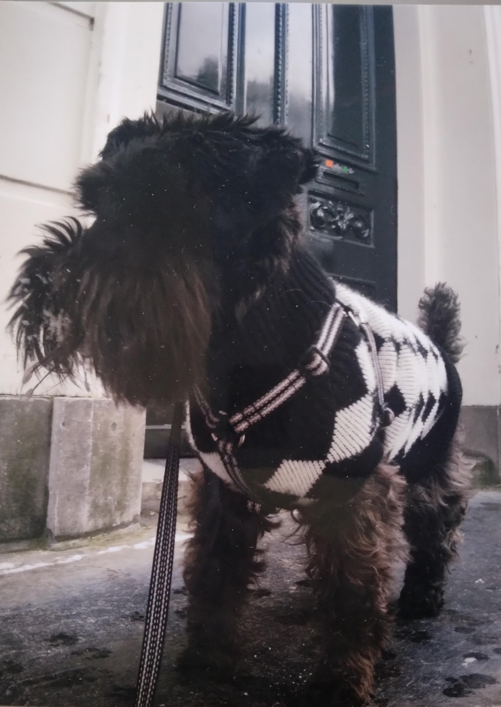

# Themba

## Images

| Filename       | Image                         |
| -------------- | ----------------------------- |
| <themba_1.jpg> |  |
| <themba_2.jpg> |  |
| <themba_3.jpg> |  |
| <themba_4.jpg> |  |
| <themba_5.jpg> |  |

## Videos

- [themba_1.mp4](themba_1.mp4)
- [themba_2.mp4](themba_2.mp4)

## Audio

- [themba_1.mp3](themba_1.mp3)
- [themba_1.ogg](themba_1.ogg)
- [themba_2.mp3](themba_2.mp3)
- [themba_2.ogg](themba_2.ogg)

From these audio files, the barks were extracted (using Audacity)
and put in the `../resources/sound_effects` folder.
